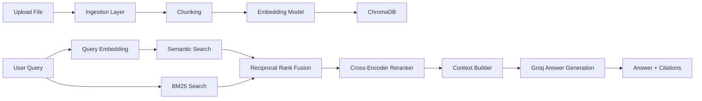

# Multimodal RAG System

A beginner-friendly multimodal RAG (Retrieval-Augmented Generation) project that lets you upload PDFs, images, and audio files, index them locally, and ask grounded questions with inline source citations.

## Author

- Created by **Harshal More**
- GitHub: [@HaRsH-2102](https://github.com/HaRsH-2102)

## Copyright

```text
Copyright (c) 2026 Harshal More. All rights reserved.
```

## What It Does

- Uploads `PDF`, `PNG/JPG/JPEG`, and `MP3/WAV/M4A` files
- Extracts text from:
  - PDFs with `PyMuPDF`
  - Images with `EasyOCR`
  - Audio with local `Whisper`
- Splits extracted text into overlapping chunks
- Stores chunk embeddings in local `ChromaDB`
- Runs hybrid retrieval with:
  - semantic search
  - BM25 keyword search
  - Reciprocal Rank Fusion
  - cross-encoder reranking
- Sends only the final grounded context to `Groq`
- Returns answers with inline citations like `[1]`, `[2]`
- Falls back safely when the answer is not present in the indexed data

## Demo Flow

1. Upload one or more source files
2. The backend extracts text and indexes chunks locally
3. Ask a question from the React frontend
4. The system retrieves the most relevant chunks
5. Groq generates a grounded answer using only retrieved context
6. The UI shows the answer plus source cards

## Architecture



## Tech Stack

### Backend

- Python
- FastAPI
- ChromaDB
- sentence-transformers
- rank-bm25
- EasyOCR
- OpenAI Whisper
- PyMuPDF
- Groq Python SDK

### Frontend

- React
- Vite
- Tailwind CSS

## Project Structure

```text
multimodal-rag/
|
|- backend/
|  |- main.py
|  |- config.py
|  |- requirements.txt
|  |- ingestion/
|  |- processing/
|  |- retrieval/
|  |- generation/
|  |- storage/
|  \- utils/
|
|- frontend/
|  |- package.json
|  |- vite.config.js
|  |- tailwind.config.js
|  \- src/
|
|- setup.ps1
|- setup.sh
\- README.md
```

## Key Features

- Local-first indexing
- Hybrid search for stronger retrieval quality
- Source-aware context formatting
- Inline citations in generated answers
- Safe fallback when information is missing
- Clean research-style frontend
- Async FastAPI endpoints

## Requirements

Install these before running the project:

- Python `3.12+`
- Node.js `20+`
- npm
- FFmpeg

## Environment Variables

Create `backend/.env` from `backend/.env.example`:

```env
GROQ_API_KEY=your_groq_api_key_here
```

## Local Setup

### Windows PowerShell

From the project root:

```powershell
Set-ExecutionPolicy -Scope Process Bypass
.\setup.ps1
Copy-Item backend\.env.example backend\.env
```

Then open `backend\.env` and add your real `GROQ_API_KEY`.

### macOS / Linux

From the project root:

```bash
chmod +x setup.sh
./setup.sh
cp backend/.env.example backend/.env
```

Then open `backend/.env` and add your real `GROQ_API_KEY`.

## Run The Backend

### Windows PowerShell

```powershell
.\backend\venv\Scripts\Activate.ps1
cd backend
uvicorn main:app --host 0.0.0.0 --port 8000 --reload
```

### macOS / Linux

```bash
source backend/venv/bin/activate
cd backend
uvicorn main:app --host 0.0.0.0 --port 8000 --reload
```

The backend will be available at:

```text
http://localhost:8000
```

## Run The Frontend

Open a second terminal:

```bash
cd frontend
npm install
npm run dev
```

The frontend will be available at:

```text
http://localhost:5173
```

## First Run Notes

- The first backend startup can take a while
- `EasyOCR`, `Whisper`, `sentence-transformers`, and the reranker may download model files
- Large files will take longer to index
- Audio support depends on FFmpeg being available in your system PATH

## How To Use

1. Start the backend
2. Start the frontend
3. Open `http://localhost:5173`
4. Upload a file
5. Wait for indexing to complete
6. Ask a question
7. Review the answer and source cards

## API Endpoints

### `GET /health`

Simple health check.

Response:

```json
{
  "status": "healthy"
}
```

### `GET /status`

Returns collection metadata and indexed chunk count.

### `POST /ingest`

Accepts a multipart file upload using the `file` field.

Example:

```bash
curl -X POST http://localhost:8000/ingest -F "file=@test.pdf"
```

### `POST /query`

Accepts a JSON body:

```json
{
  "query": "What is the main topic?"
}
```

### `DELETE /reset`

Clears and recreates the Chroma collection.

## Example Backend Health Check

### PowerShell

```powershell
Invoke-RestMethod http://localhost:8000/health
```

### curl

```bash
curl http://localhost:8000/health
```

## Grounding Rules

This project is designed to reduce hallucinations:

- Answer generation uses only retrieved source chunks
- Answers are expected to include inline citations
- If the answer is not found in the indexed data, the system returns:

```text
I could not find relevant information in the indexed data.
```

## Troubleshooting

### `GROQ_API_KEY is not set`

- Make sure `backend/.env` exists
- Make sure it contains `GROQ_API_KEY=...`
- Restart the backend after editing `.env`

### Backend starts slowly

- This is normal on first run while models download and load

### Audio files fail

- Make sure FFmpeg is installed and available in PATH
- Test with:

```bash
ffmpeg -version
```

### Frontend cannot reach backend

- Make sure the backend is running on port `8000`
- Make sure the frontend is running on port `5173`
- Check that `frontend/src/api/ragApi.js` still points to `http://localhost:8000`

## Development Notes

- Embeddings are generated locally
- BM25 is cached in memory
- ChromaDB persists data under `backend/storage/chroma_db`
- Groq is only used for final answer generation
- Uploaded files are saved temporarily during ingestion and then deleted

## Future Improvements

- Batch file ingestion
- Better chunking by sentence boundaries
- Multi-language OCR and transcription
- Metadata filters by file or type
- Streaming answers in the UI
- Authentication and multi-user collections

## License

This project is licensed as **All Rights Reserved**.

No reuse, copying, modification, distribution, or commercial/non-commercial use is allowed without prior written permission from the author.

See [LICENSE](./LICENSE) for details.
